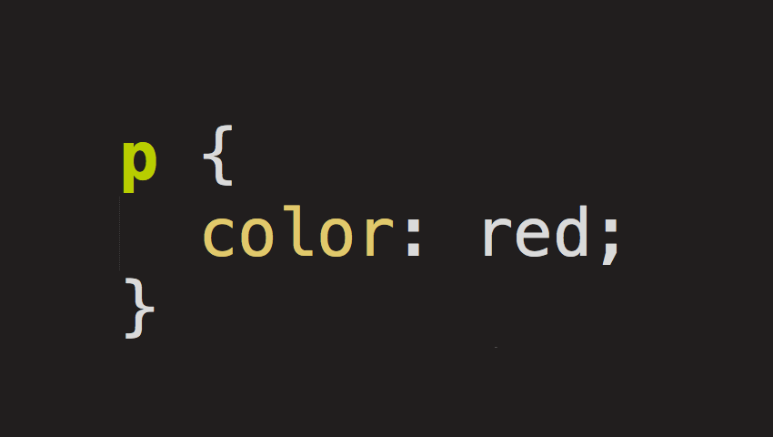

# CSS (Style your HTML!)

Du hast sicher gemerkt, dass dein HTML-Dokument etwas öde aussieht, im Vergleich zum Original-Artikel.
Das liegt daran, dass das CSS fehlt.

> CSS => **C**ascading **S**tyle **S**heets

## Wofür ist CSS?

Man verwendet CSS, um HTML-Dokumente besser zu gestalten.

- Öffne [unseren Onlineshop][https://www.digitec.ch]
- Öffne die DevTools deines Browsers und lösche den `<head>` des HTML-Codes (CSS muss weg zum demonstrieren)
    - Falls du nicht weisst, wie man das macht, hole einen von uns zu dir
- So sieht eine Website mit reinem HTML aus. Deswegen braucht man CSS!

## Was sind CSS-Rules?

Eine "CSS-Rule"...
> 

... besteht aus diesen Teilen:
> 

- Der **"Selektor"** beschreibt, auf welche Elemente das CSS angewendet wird.  
    - kann verschiedene Sachen "selektieren":
        - Klassen (`.`)
        - Element-IDs (`#`)
        - Element-Typen (z.B. `div`)
        - *sonstige Eigenschaften des Elements*

- Man kann mehrere **Deklarationen** in einer CSS-Rule haben.
- In einer **Deklaration** werden **Values** werden an **Properties** zugewiesen, um zu definieren, wie die CSS-Rule **die Elemente verändert**.

## Wie funktioniert CSS?

### -> IDs

Selektoren wie `p { }` oder `div { }` gehen automatisch mit den gewünschten Elementen, aber IDs und Klassen funktionieren etwas anders.

Als Beispiel hast du hier für die ID `test-id` eine CSS-Rule.
```CSS
#test-id {
    color: red;
}
```
Diese ID kannst du dann einem Element im `id`-Attribut übergeben: 
```CSS
<div id="test-id">  </div>
```
> - Eine ID soll **maximal ein Element** haben.
> - Ein Element kann auch nicht mehrere IDs haben.  

### -> Klassen
Klassen funktionieren etwa gleich, aber sie haben die oben genannten Limitationen nicht.  
Sie können also auf **mehreren Elementen** angewendet werden, und Elemente können auch **mehrere Klassen** haben.

#### **Ein Beispiel:**
**CSS**
```CSS
.test-class {
    color: white;
    font-weight: bold;
}

.another-test-class {
    background: blue;
}
```

**HTML**
```HTML
<div class="test-class another-test-class"> Dieser Text ist weiss und fettgedruckt. Der Hintergrund ist blau. </div>
```

**Resultat**
> <div style="color: white; background: blue"> Dieser Text ist weiss und fettgedruckt. Der Hintergrund ist blau. </div>  

## CSS anwenden

Angenommen, du hast eine CSS-Datei namens `stylesheet.css` und ein HTML-Dokument.  
In deinem HTML-Dokument kannst du im `<head>` folgendes Element einfügen:
```HTML
<link rel="stylesheet" href="stylesheet.css">
```
> *Der angegebene Pfad zur CSS-Datei ist **relativ** zum "jetzigen" Ordner.*
> Datei-Pfade können auch vollständig ausgeschrieben sein.

Das Element stellt eine *Referenz* zum CSS her.

~  
~  
~  
~  
~  
~  
~  
~  
~  
~  
~  
~  
~  
~  
~  
~  
~  
~  
~  
~  
~  

## Beispiele von CSS-Rules

> **Zentriert den Text** in den Elementen mit der Klasse `this-is-a-class`.
```CSS
.this-is-a-class {
    text-align: center;
}
```

---

> Macht die **Schriftfarbe** im Element mit der ID `test-id` **rot**.
```CSS
#test-id {
    color: red;
}
```

---

> Macht die **Hintergrundfarbe** in `p`-Elementen **blau**.
```CSS
p {
    background-color: blue;
}
```
