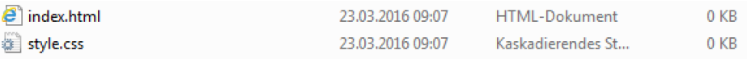
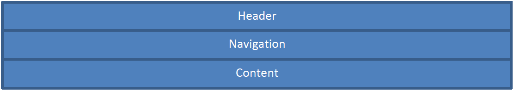
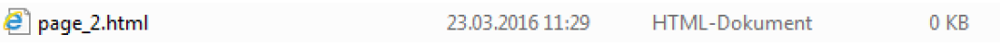

# Aufgaben CSS

Deine Aufgabe ist es, eine neue Digitec Webseite zu erstellen. Zur Hilfe hast du diese
Anleitung und du kannst jeder Zeit Fragen stellen oder online recherchieren.

## Erstellen der Index-Datei und des Stylesheets

Die Index-Datei enthält HTML-Code welcher den Inhalt der Seite beschreibt und die Style-Datei enthält CSS-Code, welcher das Design beschreibt.
(HTML = Hypertext Markup Language, CSS = Cascading Style Sheet)

***Beispiel:***



## Grundgerüst erstellen in der Index-Datei

Im Grundgerüst sind Tags enthalten, welche für die Konfigurationen zuständig sind.

***Code:***

```HTML
<!DOCTYPE html>
<html lang="en">

    <head>
        <meta charset="UTF-8">
        <title> Titel der Seite </title>
    </head>

    <body>

    </body>

</html>
```

## Hello World

```html
<h1>Hello World</h1>
```

## Stylesheet einbinden

Das Stylesheet muss zuerst eingebunden werden, damit der Browser weiss, in welcher Datei er
den Style suchen muss. Das ganze wird unterhalb von `<meta charset="utf-8">` eingefügt.

***Code:***

```html
<link rel="stylesheet" type="text/css" href="style.css"/>
```

<div class="page-break"></div>

## CSS Änderungen

***Code:***
```css
* {
  font-family: Arial;
  margin: 0 auto;
  background-color: #3C9A5F;
}
```

## DIVs erstellen

DIVs kann man sich wie Rahmen vorstellen. Man kann kleine DIVs in grössere verschachteln, DIVs nebeneinander setzen und natürlich in den DIVs Elemente einbauen. Der Code unten erstellt bildlich dargestellt ungefähr so etwas:



***Code:***

```html
<div id="container">
    <div id="header">
    </div>
    <div id="navigation">
    </div>
    <div id="content">
    </div>
</div>
```

## Titel & Text einfügen

Nun können wir in die DIVs z.B. etwas reinschreiben. In Welches DIV würdest du einen Titel tun?

Setze folgende Elemente sinnvoll ein.

***Code:***

```html
<h1>Titel</h1>
<h2>Überschrift</h2>
<h3>Überschrift</h3>
<p>Normaler Text</p>
```

<div class="page-break"></div>

## Bild einfügen
Ein Bild einfügen ist relativ simpel. Beim Pfad `src` muss man den Pfad gefolgt vom Dateinamen eingeben und bei `alt` eine Art Beschreibung. (Achte auf Tippfehler!)

***Code:***

```html

```

In obigem Beispiel, muss das Bild im Dateiordner `img` liegen. es kann aber auch  eine Adresse eines beliebigen Bildes aus dem Web genutzt werden, z.B. dieses ProduktBild:
 
 ```
https://static.digitecgalaxus.ch/Files/2/2/0/3/0/1/2/8/Xiaomi-Mijia-Folding-Electric-Scooter-Pro-Black-828159-.jpg?fit=inside%7C310:330&output-format=progressive-jpeg
```

## Weitere Seite erstellen und verlinken

Erstelle eine neue HTML-Datei und Kopiere das Grundgerüst in die neue Datei.

***File:***



Mit diesem Link kannst auf eine neue Seite wechseln.

***Code:***

```html
<a href="page_2.html">Produkte</a>
```

## Einen Link auf einem Bild erstellen

***Code:***

```html
<a href="page_2.html"></a>
```

<div class="page-break"></div>

## Tabelle einfügen

Eine Tabelle kann in gewissen Fällen sehr nützlich und hilfreich sein, z.B. wenn man eine
Preisliste machen muss, muss man nicht von Hand zurechtrücken.

Füge nun die Tabelle am richtigen Ort ein und befülle die Felder.

(tr=Table Row, td=Table data -> td enthält nachher die Daten zum Ausgeben)

***Code:***

```html
<table>
    <tr>
        <td></td>
        <td></td>
    </tr>
    <tr>
        <td></td>
        <td></td>
    </tr>
</table>
```

## Border collapse
Mit diesem Befehl kann man die Rahmen aller Felder zusammenfügen, sodass zwischen
zwei Feldern nur noch eine Linie ist.

***Code:***

```css
  table {
    border-collapse: collapse;
  }
```

## Abstände ändern

***Code:***

```css
#header {
    padding-top: 20px;
    padding-bottom: 20px;
    text-align: center;
    border: 2px solid black;
}
```

## Borderradius ändern

Manchmal möchte man, dass etwas abgerundet ist. Dies kann mit dem border-radius gemacht werden.

***Code:***

```css
/* hier werden die Bilder abgerundet, aber was würdest du ändern, damit der Header abgerundet ist? */
img {
    border-radius: 4px 4px 4px 4px;
}
```

<div class="page-break"></div>

## Listen erstellen

Häufig verwendet man eine Liste von Links um eine Navigation zu erstellen:

***Code***

```html
<ul class="nav">
  <li><a href="index.html">Homepage</a></li>
  <li><a href="page_2.html">Produkte</a></li>
</ul>
```

Hier kommt auch eine `class` Attribut zum Einsatz. Klassen werden häufig genutzt um im Styling dieses Element selektieren zu können (siehe unten)

## Hover

***Code:***

```css
.nav li a:hover {
  background-color: #f60;
}
```

## Shortcut Icon
Damit im Browser unser Logo in den Tabs angezeigt wird, muss noch das Shortcut-Icon im Head hinterlegt werden.

***Code:***

```html
<link rel="shortcut icon" href="img/favicon.ico" type="image/x-icon"/>
```

~  
~  
~  
~  
~  
~  
~  
~  
~  
~  
~  
~  
~  
~  
~  
~  
~  
~  
~  
~  
~  

## Zusatzaufgaben
3. Recherchiere was “Scale on Hover with Transition“ ist, was es macht und versuche
es auf deiner Webseite sinnvoll einzusetzen.
4. Wenn du mit allem fertig sind, kannst du nun eine Website mit folgenden Rahmenbedingungen
erstellen:

***Die Website muss***

* eine Produktliste beinhalten
* mindestens ein Produkt in der Liste sollte mit einer Produkdetailseite verlinkt sein

***Die Website darf***
* komplett anders aussehen als [https://www.digitec.ch](https://www.digitec.ch)
* eine Navigation haben
* auch andere Elemente als die obigen beinhalten (versuche es am Anfang mit den obigen, wenn du dann noch Zeit hast, kannst du noch weitere recherchieren und verwenden)
* auch JavaScript verwenden (nur für Profis 😉 )